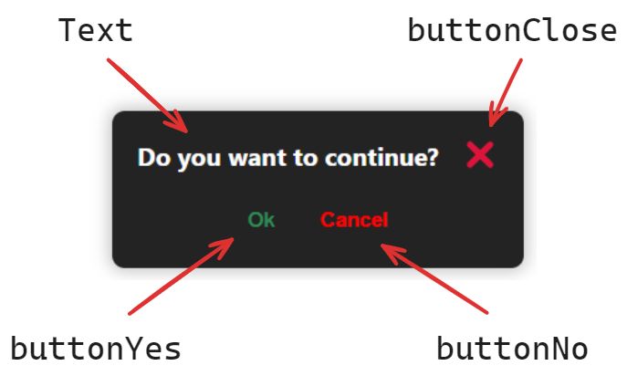

# react-confirm-toast

> A light and customizable confirm toast component.

Creates a toast notification which allows you to confirm or reject the execution of a function.

## Features 🎯

- 💬 **Modal or not:** use it as you prefer.
- 📱 **Responsive:** dynamically scale according to viewport.
- 🧩 **Typed:** fully typed for enhanced development experience.
- 🚀 **Performant:** optimized to be fast.
- 🌈 **Accessible:** designed and conceived to leave no one behind.
- 🖱 **Mouse, keyboard and gesture friendly:** click out the modal, click the close button or press `ESC` to close it.
- 🕵🏽 **Customizable:** change the **texts**, choose among the 4 available **themes** or create your own, change the **position**, hide the close icon, and much more.

## Installation 🚀

This package is in the [npm registry](https://www.npmjs.com/package/react-confirm-toast), so you can install it with your preferred dependency manager.

For example, with `npm`, you can run the following command:

```sh
npm install react-confirm-toast
```

## Requirements 🔍

[React](https://www.npmjs.com/package/react) and [React-dom](https://www.npmjs.com/package/react-dom) are peer dependencies. Your project needs to have them installed in order to use this confirm toast.

## Component structure 🧱

This component is divided in 4 elements with standardized naming:

- **text**: as it seems, is the toast text.
- **buttonClose**: the close icon button.
- **buttonYes**: the accept button.
- **buttonNo**: the decline button.



This naming is maintained in all React and custom properties.

## Properties ⚙️

|           Name            |                                Value                                 |           Default            | Required | Description                                                                                             |
| :-----------------------: | :------------------------------------------------------------------: | :--------------------------: | :------: | ------------------------------------------------------------------------------------------------------- |
|    **customFunction**     |                              `Function`                              |                              |    ✅    | Defines the function to confirm.                                                                        |
|   **showConfirmToast**    |                              `boolean`                               |                              |    ✅    | A boolean React state that controls the toast.                                                          |
|  **setShowConfirmToast**  |           `React.Dispatch<React.SetStateAction<boolean>>`            |                              |    ✅    | The `setState` of the `showConfirmToast` state.                                                         |
|        **asModal**        |                              `boolean`                               |           `false`            |          | Toast will be displayed as a modal element, in the center of the viewport and darkening the background. |
|    **buttonCloseA11y**    |                               `string`                               |       `'Close modal'`        |          | Sets the accessibility text for the `buttonClose` element.                                              |
| **buttonCloseAttributes** |                     `React.ButtonHTMLAttributes`                     |                              |          | Sets the HTML Button attributes to pass to the `buttonClose` element.                                   |
|  **buttonNoAttributes**   |                     `React.ButtonHTMLAttributes`                     |                              |          | Sets the HTML Button attributes to pass to the `buttonNo` element.                                      |
|     **buttonNoText**      |                               `string`                               |          `'Cancel'`          |          | Sets the cancel button message.                                                                         |
|  **buttonYesAttributes**  |                     `React.ButtonHTMLAttributes`                     |                              |          | Sets the HTML Button attributes to pass to the `buttonYes` element.                                     |
|     **buttonYesText**     |                               `string`                               |            `'Ok'`            |          | Sets the confirm button message.                                                                        |
|       **className**       |                               `string`                               |                              |          | Adds a class to the element.                                                                            |
|       **position**        | `'bottom-left'` \| `'bottom-right'` \| `'top-left'` \| `'top-right'` |       `'bottom-right'`       |          | Sets the toast position. It will be ignored if `asModal` is `true`.                                     |
|     **showCloseIcon**     |                              `boolean`                               |            `true`            |          | Sets if the close icon is displayed.                                                                    |
|         **theme**         |            `'light'` \| `'dark'` \| `'snow'` \| `'lilac'`            |          `'light'`           |          | Sets the toast style theme.                                                                             |
|       **toastText**       |                               `string`                               | `'Do you want to continue?'` |          | Sets the toast question text.                                                                           |

## Creating or updating a theme 🦾

For this purpose, there are some **custom properties** that you can override, passing a class to the `className` prop:

|                 Name                 |      CSS rule      | Description                                                       |
| :----------------------------------: | :----------------: | ----------------------------------------------------------------- |
|        **--confirm-toast-bg**        | `background-color` | Background color of the confirm toast.                            |
|    **--confirm-toast-box-shadow**    |    `box-shadow`    | Box shadow of the confirm toast.                                  |
|    **--confirm-toast-text-color**    |      `color`       | Color of the message text in the confirm toast.                   |
| **--confirm-toast-btn-close-color**  |      `color`       | Color of the `button-close` in the confirm toast.                 |
|    **--confirm-toast-btn-yes-bg**    | `background-color` | Background color of the `button-yes` in the confirm toast.        |
|  **--confirm-toast-btn-yes-color**   |      `color`       | Color of the `button-yes` text in the confirm toast.              |
|    **--confirm-toast-btn-no-bg**     | `background-color` | Background color of the `button-no` in the confirm toast.         |
|   **--confirm-toast-btn-no-color**   |      `color`       | Color of the `button-no` text in the confirm toast.               |
|    **--confirm-toast-btn-hover**     |      `filter`      | Filter value for each button's hover effect in the confirm toast. |
|  **--confirm-toast-btn-yes-focus**   |     `outline`      | Outline value for the focus effect in the `button-yes`.           |
|   **--confirm-toast-btn-no-focus**   |     `outline`      | Outline value for the focus effect in the `button-no`.            |
| **--confirm-toast-btn-close-focus**  |     `outline`      | Outline value for the focus effect in the `button-close`.         |
| **--confirm-toast-btn-no-disabled**  |      `filter`      | Filter value for the disabled style in the `button-no`.           |
| **--confirm-toast-btn-yes-disabled** |      `filter`      | Filter value for the disabled style in the `button-yes`.          |

## Examples 📝

### Minimum working example

This is a minimum working example, using the 3 required props:

```jsx
import { useState } from 'react'
import { ConfirmToast } from '../ConfirmToast'

export function Page() {
  const [show, setShow] = useState(false)

  function myFunction() {
    alert('Done!')
  }

  return (
    <section>
      <h1>Page</h1>
      <button
        onClick={() => {
          setShow(true)
        }}
      >
        Click to open ConfirmToast
      </button>
      <ConfirmToast
        customFunction={myFunction}
        setShowConfirmToast={setShow}
        showConfirmToast={show}
      />
    </section>
  )
}
```

### Modal example

```jsx
import { useState } from 'react'
import { ConfirmToast } from '../ConfirmToast'

export function Page() {
  const [show, setShow] = useState(false)

  function myFunction() {
    alert('Done!')
  }

  return (
    <section>
      <h1>Page</h1>
      <button
        onClick={() => {
          setShow(true)
        }}
      >
        Click to open ConfirmToast
      </button>
      <ConfirmToast
        asModal={true}
        customFunction={myFunction}
        setShowConfirmToast={setShow}
        showConfirmToast={show}
      />
    </section>
  )
}
```

### Changing theme and texts

```jsx
import { useState } from 'react'
import { ConfirmToast } from '../ConfirmToast'

export function Page() {
  const [show, setShow] = useState(false)

  function myFunction() {
    alert('Done!')
  }

  return (
    <section>
      <h1>Page</h1>
      <button
        onClick={() => {
          setShow(true)
        }}
      >
        Click to open ConfirmToast
      </button>
      <ConfirmToast
        buttonNoText='No'
        buttonYesText='Yes'
        customFunction={myFunction}
        setShowConfirmToast={setShow}
        showConfirmToast={show}
        theme='dark'
        toastText=''
      />
    </section>
  )
}
```

### Passing props to buttons

If you want to pass attributes to the buttons, for example for adding a `disabled` attribute, you can use the following properties:

- For `buttonYes` use the `buttonYesAttributes` property.
- For `buttonNo` use the `buttonNoAttributes` property.
- For `buttonClose` use the `buttonCloseAttributes` property.

```jsx
import { useState } from 'react'
import { ConfirmToast } from './'

export function Page() {
  const [show, setShow] = useState(false)

  function myFunction() {
    alert('Done!')
  }

  const buttonAttributes = { disabled: true, 'aria-label': 'Custom Aria Label' }

  return (
    <section>
      <h1>Page</h1>
      <button
        onClick={() => {
          setShow(true)
        }}
      >
        Click to open ConfirmToast
      </button>
      <ConfirmToast
        buttonYesAttributes={buttonAttributes}
        customFunction={myFunction}
        setShowConfirmToast={setShow}
        showConfirmToast={show}
      />
    </section>
  )
}
```

### Using a custom theme

Create a CSS class with the desired custom properties.

```css
.custom-confirm-toast-theme {
  --confirm-toast-bg: aquamarine;
  --confirm-toast-box-shadow: 0 0 1px 4px purple;
  --confirm-toast-text-color: purple;
  --confirm-toast-icon-color: black;
  --confirm-toast-btn-yes-bg: green;
  --confirm-toast-btn-yes-color: lightgreen;
  --confirm-toast-btn-no-bg: yellow;
  --confirm-toast-btn-no-color: black;
  --confirm-toast-btn-hover: brightness(0.9);
  --confirm-toast-btn-yes-focus: 2px solid orange;
  --confirm-toast-btn-no-focus: 2px solid orange;
  --confirm-toast-btn-close-focus: 2px solid red;
  --confirm-toast-btn-no-disabled: opacity(0.6);
  --confirm-toast-btn-yes-disabled: opacity(0.6);
}
```

And pass it to the `className` property.

```jsx
import 'custom-theme.css'
import { useState } from 'react'
import { ConfirmToast } from '../ConfirmToast'

export function Page() {
  const [show, setShow] = useState(false)

  function myFunction() {
    alert('Done!')
  }

  return (
    <section>
      <h1>Page</h1>
      <button
        onClick={() => {
          setShow(true)
        }}
      >
        Click to open ConfirmToast
      </button>
      <ConfirmToast
        className='custom-confirm-toast-theme'
        customFunction={myFunction}
        setShowConfirmToast={setShow}
        showConfirmToast={show}
      />
    </section>
  )
}
```

## Migration from `v1` to `v2`

In this version there are several breaking changes:

### Component properties & custom properties naming

Although the behavior remains unchanged, some **component properties** have been renamed due to syntax reasons:

|    Previous name    |  Current name   |
| :-----------------: | :-------------: |
| `childrenClassName` |   `className`   |
|   `customCancel`    | `buttonNoText`  |
|   `customConfirm`   | `buttonYesText` |
|      `message`      |   `toastText`   |

Also, there are some **custom properties** that have been renamed:

|        Previous name         |           Current name            |
| :--------------------------: | :-------------------------------: |
| `--confirm-toast-msg-color`  |   `--confirm-toast-text-color`    |
| `--confirm-toast-icon-color` | `--confirm-toast-btn-close-color` |

### New required attributes

In this version, the component doesn't control its own state. This decision has been made to increase the flexibility of the component and to enable its programmatic use.

For this, now there are two new props:

- `showConfirmToast` (`boolean`): the boolean state.
- `setShowConfirmToast` (`React.Dispatch<React.SetStateAction<boolean>>`): the state setter.

## Custom properties

- `--confirm-toast-btn-hover` has been changed.

  Before, the custom property was engaged to the `brightness` filter function.

  ```css
  .button:hover {
    filter: brightness(var(--confirm-toast-btn-hover));
  }
  ```

  Now, this custom property sets the `filter` CSS rule.

  ```css
  .button:hover {
    filter: var(--confirm-toast-btn-hover);
  }
  ```
